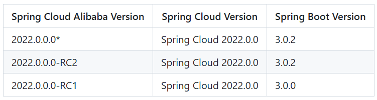

## 查看版本对应关系
springcloud、springcloudalibaba、springboot三者的版本对应关系可以通过这个[链接](https://github.com/alibaba/spring-cloud-alibaba/wiki/%E7%89%88%E6%9C%AC%E8%AF%B4%E6%98%8E)查看.
 

## 导入依赖
分别导入spring-cloud和spring-cloud-alibaba
导入方式采用import搭配pom方式，这种方式可以将其中的<dependencyManagement>也进行继承，以便在本项目中进行严格的版本控制。
```java
<parent>
    <groupId>org.springframework.boot</groupId>
    <artifactId>spring-boot-starter-parent</artifactId>
    <version>3.0.6</version>
    <relativePath/> <!-- lookup parent from repository -->
</parent>

<properties>
    <java.version>17</java.version>
    <spring-cloud.version>2022.0.0</spring-cloud.version>
    <spring-cloud-alibaba.version>2022.0.0.0-RC2</spring-cloud-alibaba.version>
</properties>

<dependencyManagement>
    <dependencies>
        <dependency>
            <groupId>org.springframework.cloud</groupId>
            <artifactId>spring-cloud-dependencies</artifactId>
            <version>${spring-cloud.version}</version>
            <type>pom</type>
            <scope>import</scope>
        </dependency>
        <dependency>
            <groupId>com.alibaba.cloud</groupId>
            <artifactId>spring-cloud-alibaba-dependencies</artifactId>
            <version>${spring-cloud-alibaba.version}</version>
            <type>pom</type>
            <scope>import</scope>
        </dependency>
    </dependencies>
</dependencyManagement>
```


