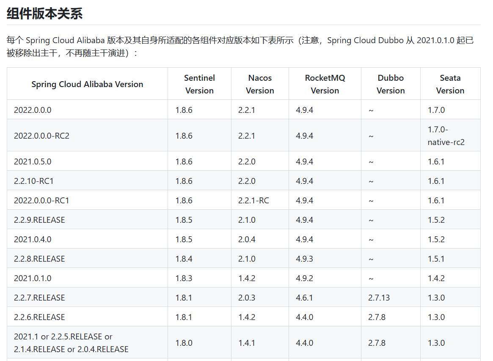

## nacos服务发现于注册接入
首先在此[链接](https://github.com/alibaba/spring-cloud-alibaba/wiki/%E7%89%88%E6%9C%AC%E8%AF%B4%E6%98%8E?spm=5238cd80.5e8a737d.0.0.460f7e84BZ96BF)查看nacos版本对应关系。


导入服务发现依赖
```java
<dependency>
    <groupId>com.alibaba.cloud</groupId>
    <artifactId>spring-cloud-starter-alibaba-nacos-discovery</artifactId>
</dependency>
```

启动nacos后，在java项目中配置
```yml
spring:
  application:
    name: depart-consumer   # 服务名称
  cloud:
    nacos:
      discovery:
        server-addr: localhost:8849,localhost:8851,localhost:8853  # nacos地址,若nacos以集群方式启动可以写多个，否则写一个即可
```

## nacos接入后可通过服务名称进行服务消费
首先需要导入负载均衡依赖
```java
<dependency>
    <groupId>org.springframework.cloud</groupId>
    <artifactId>spring-cloud-starter-loadbalancer</artifactId>
</dependency>
```

注：本节所导入的依赖均不需要填写版本号，因为上节提到了用import和pom方式导入父包进行版本控制

### 通过原始RestTemplate进行服务消费
原始的RestTemplate需要指明请求接收端明确的ip和port，这也就导致了它只有一个目标，即远端服务只有一个，无法实现集群与负载均衡

配置RestTemplate
```java
@Configuration
public class DepartConfig {

    @Bean
    public RestTemplate restTemplate() {
        return new RestTemplate();
    }
}
```

Controller消费服务
```java
@RestController
@RequestMapping("/consumer/depart")
public class DepartController {

    @Autowired
    private RestTemplate restTemplate;

    private static final String URL = "http://localhost:8081/provider/depart/";

    @GetMapping("/{id}")
    public Depart getDepart(@PathVariable("id") int id) {
        return restTemplate.getForObject(URL + id, Depart.class);
    }

    @PostMapping("/")
    public Boolean addDepart(@RequestBody Depart depart) {
        return restTemplate.postForObject(URL, depart, Boolean.class);
    }

    @DeleteMapping("/{id}")
    public void deleteDepart(@PathVariable("id") int id) {
        restTemplate.delete(URL+id);
    }

    @PutMapping("/")
    public void updateDepart(@RequestBody Depart depart) {
        restTemplate.put(URL, depart);
    }

    @GetMapping("/list")
    public List<Depart> getDepartList() {
        return restTemplate.getForObject(URL+"list", List.class);
    }

}
```

### 通过nacos实现负载均衡

配置RestTemplate，注意这里增加了一个注解@LoadBalanced，此注解只能用于RestTemplate类，其底层是对每个RestTemplate请求进行拦截，识别url中的服务名，并且取得服务的全部实例，实现负载均衡。
```java
@Configuration
public class DepartConfig {

    @LoadBalanced
    @Bean
    public RestTemplate restTemplate() {
        return new RestTemplate();
    }

}
```

Controller消费服务
```java
@RestController
@RequestMapping("/consumer/depart")
public class DepartController {

    @Autowired
    private RestTemplate restTemplate;

    private static final String URL = "http://depart-provider/provider/depart/";

    @GetMapping("/{id}")
    public Depart getDepart(@PathVariable("id") int id) {
        return restTemplate.getForObject(URL + id, Depart.class);
    }

    @PostMapping("/")
    public Boolean addDepart(@RequestBody Depart depart) {
        return restTemplate.postForObject(URL, depart, Boolean.class);
    }

    @DeleteMapping("/{id}")
    public void deleteDepart(@PathVariable("id") int id) {
        restTemplate.delete(URL+id);
    }

    @PutMapping("/")
    public void updateDepart(@RequestBody Depart depart) {
        restTemplate.put(URL, depart);
    }

    @GetMapping("/list")
    public List<Depart> getDepartList() {
        return restTemplate.getForObject(URL+"list", List.class);
    }

}
```
